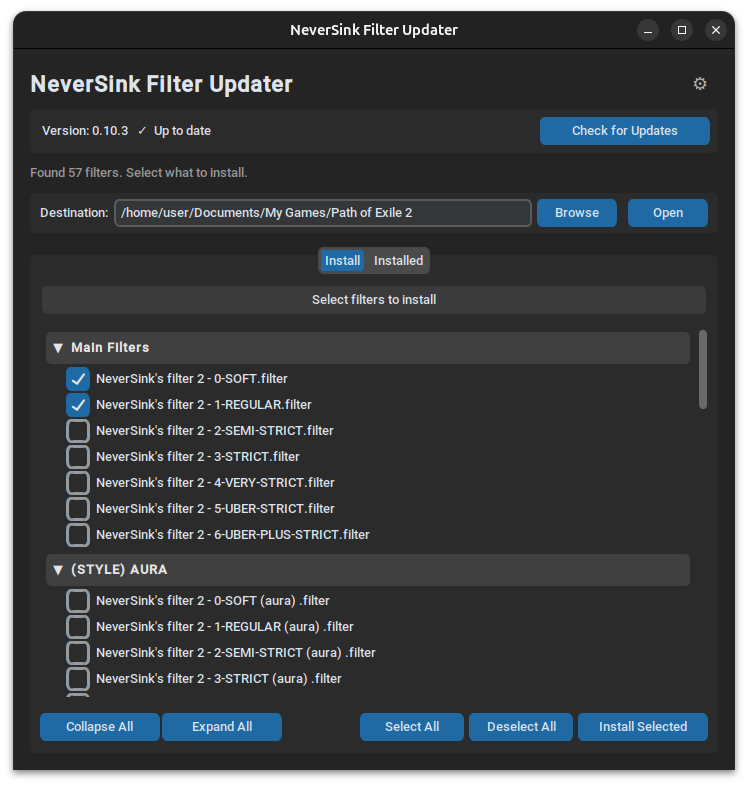

# PoE2 Filter Updater

Desktop application for automatically downloading and updating the [NeverSink loot filter](https://github.com/NeverSinkDev/NeverSink-Filter-for-PoE2) for Path of Exile 2.

On launch the app checks the latest GitHub release, downloads it if a new version is available, and lets you choose exactly which filters to install via a selection UI. Filter categories (Main, Zen, Aura, etc.) are collapsible.



## Features

- Checks GitHub for the latest NeverSink release on every launch
- Downloads the archive only when a new version is available (cached locally)
- Groups filters by collapsible categories (Collapse All / Expand All support)
- Pre-selects the main strictness filters; custom variants are opt-in
- Copies only selected `.filter` files — nothing else touches your PoE2 folder
- **Installed** tab: browse, select, and delete filters already in your PoE2 folder
- Configurable destination path with a folder browser

## Requirements

- Windows 10/11
- Python 3.12+ **or** the standalone `.exe` (no Python needed)

## Usage

### Option A — Run from source

**Windows:**

```bat
pip install -r app\requirements.txt
python app\main.py
```

**Linux / macOS (dev):**

```bash
pip install -r app/requirements.txt
python app/main.py
```

### Option B — Build a standalone executable

**Windows** — double-click `build.bat` or run from the project root:

```bat
build.bat
```

Produces `dist\PoE2FilterUpdater.exe`. Copy it anywhere — no Python required.

**Linux** (produces a Linux binary for testing):

```bash
bash build.sh
```

**Automated Windows build via GitHub Actions:**
Push a version tag to trigger the workflow — a `PoE2FilterUpdater.exe` artifact is attached to the run:

```bash
git tag v1.0.0
git push origin v1.0.0
```

You can also trigger it manually in the *Actions* tab on GitHub.

### Destination path

The default destination is:

```text
%USERPROFILE%\Documents\My Games\Path of Exile 2
```

You can change it in the app at any time using the Browse button.

### Automatic updates on login (optional)

1. Open **Task Scheduler** → *Create Basic Task*
2. Trigger: **At log on**
3. Action: **Start a program** → path to `PoE2FilterUpdater.exe`
4. Finish.

## File layout

```text
poe-filter-autoupdater/
├── .github/
│   └── workflows/
│       └── build.yml    # automated Windows .exe build (push a v* tag)
├── app/
│   ├── main.py          # UI (customtkinter)
│   ├── core.py          # GitHub API + archive logic (stdlib only)
│   └── requirements.txt
├── build.bat            # Windows build script (run from project root)
├── build.sh             # Linux build script (dev/testing)
├── .gitignore
└── README.md
```

## How it works

1. Calls the GitHub API to get the latest release tag and `zipball_url`.
2. Compares the tag with `cached_version.txt`. If different (or cache missing) — downloads the archive.
3. Scans the archive for all `*.filter` files and groups them by subdirectory.
4. Displays grouped, collapsible sections with checkboxes (main filters pre-checked).
5. On *Install Selected* — extracts chosen files directly to the destination folder from the cached zip.

## License

MIT
